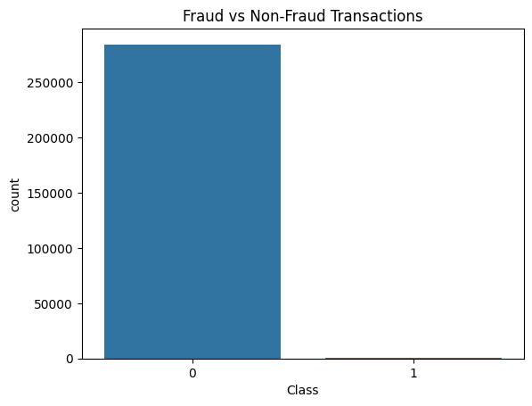
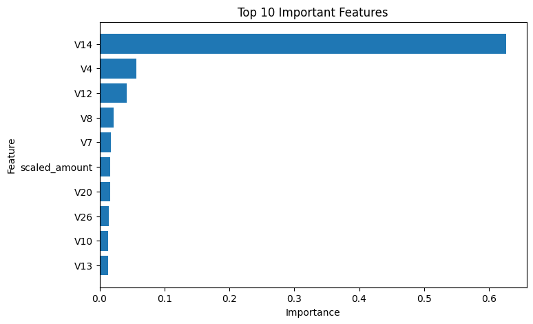
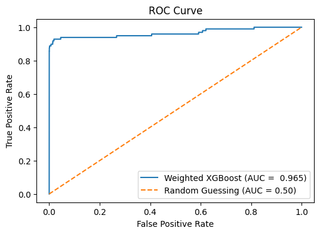

# Credit Card Fraud Detection using Machine Learning

## Project Overview

This project develops a machine learning-based fraud detection system for identifying fraudulent credit card transactions.

The dataset contains over 284,000 transactions and exhibits severe class imbalance, with fraudulent transactions accounting for only 0.17% of all observations.

Multiple machine learning algorithms were evaluated, including Logistic Regression, Random Forest, and XGBoost, along with class imbalance handling techniques such as SMOTE and class-weighted learning.

---

## Dataset

Dataset: Credit Card Fraud Detection Dataset

Source:
https://www.kaggle.com/datasets/mlg-ulb/creditcardfraud

Features:

* V1–V28: PCA-transformed features
* Time: Seconds elapsed between transactions
* Amount: Transaction amount
* Class:

  * 0 = Legitimate Transaction
  * 1 = Fraudulent Transaction

---

## Project Workflow

1. Data Loading and Exploration
2. Exploratory Data Analysis (EDA)
3. Feature Scaling
4. Train-Test Split
5. Logistic Regression
6. Logistic Regression + SMOTE
7. Random Forest
8. Random Forest + SMOTE
9. XGBoost
10. Weighted XGBoost
11. Cross Validation
12. Hyperparameter Tuning
13. Feature Importance Analysis
14. ROC-AUC Evaluation

---

## Results

| Model                       | Precision | Recall | F1-Score |
| --------------------------- | --------- | ------ | -------- |
| Logistic Regression         | 0.83      | 0.64   | 0.72     |
| Logistic Regression + SMOTE | 0.06      | 0.92   | 0.11     |
| Random Forest               | 0.94      | 0.82   | 0.87     |
| Random Forest + SMOTE       | 0.82      | 0.82   | 0.82     |
| XGBoost                     | 0.87      | 0.80   | 0.83     |
| Weighted XGBoost            | 0.88      | 0.85   | 0.86     |

---

## Final Model

Weighted XGBoost

Performance:

* Precision: 88%
* Recall: 85%
* F1-Score: 86%
* ROC-AUC: 0.965

---

## Visualizations

### Class Distribution

### Feature Importance

### ROC Curve

---

## Technologies Used

* Python
* Pandas
* NumPy
* Matplotlib
* Seaborn
* Scikit-Learn
* Imbalanced-Learn
* XGBoost

---
